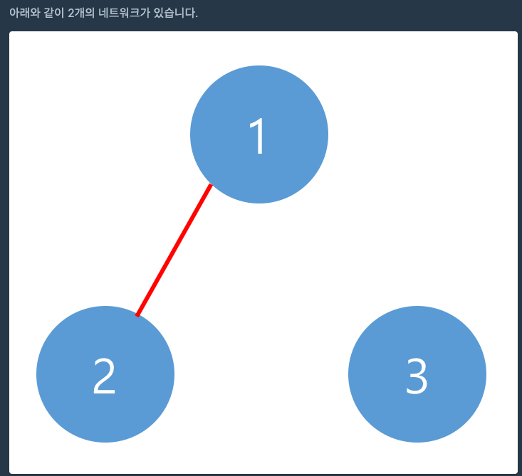

# 네트워크

- 조금 재미있는 문제라서 풀어봤다. 그리고 요즘 알고리즘 테스트를 너무 준비안하는것 같은 느낌이들어 풀어봤다..



간단하게 위 사진처럼 네트워크가 몇개 있는지 구하는건데 되게 컨셉은 간단한것 같았다.

그리고 풀고나서 보니 다들 비슷하게 풀었다~!

## 풀이

배열에 [i][j] 가 있으면 i 랑 j 가 연결되어 있다는게 기본 컨셉이다.
그래서 그냥 간단하게 중복만 안되면 되겠네 싶어서 visited 배열을 만들고, 아래와 같이 풀었다.

간단하게 설명하면 1 번 노드랑 2번 노드랑 연결되어 있다는게 처음 배열에
{{0,1,0} , {1,0,0} , {0,0,0}} 뭐 이런식으로 구현되어 있을 것이다.
어차피 연결되면 1개인거니까 그래서 visited 라는 하나의 배열을 만들고, 연결되어있는곳을 true 로 만들었다.
그리고 loop 돌면서 false 이면 ++

```java
class Solution {
    public int solution(int n, int[][] computers) {
        int answer = 0;
        boolean[] visited = new boolean[n];
        for (int i = 0; i < n; i++) {
            if (!visited[i]) {
                dfs(computers, i, visited);
                answer++;
            }
        }

        return answer;
    }

    boolean[] dfs(int[][] computers, int i, boolean[] visited) {
        visited[i] = true;
        for (int j = 0; j < computers.length; j++) {
            if (computers[i][j] == 1 && !visited[j]) {
                visited = dfs(computers, j, visited);
            }
        }
        return visited;
    }
}
```
