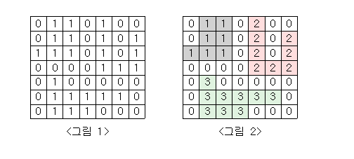

# [백준 알고리즘 - 단지 번호 붙이기]

일단 문제는 2차원 좌표로 주어진 그래프들에 대한 탐색을 시도하여 집을 찾으라는 문제다.

근데 아파트를 구역별로 나누는 것을 요구했다.



일단 dfs 랑 bfs 를 2차원에서 [상 , 하 , 좌 , 우 ] 로 움직여야 하기에 위와 같이 dx / dy 를 추가했다.

그럼 dx + dy 를 더했을때는 하나의 제약이 걸린다 0 보다는 커야하고 size 보다는 작아야 한다.

그러면 우리가 봤을때 탐색이 끝나는 기준은 0으로 도달해서 더이상 진행이 불가능할때이다. 그때까지가 한 주택단지의 구역이다.

그러니 우리는 1인 구간에서만 탐색을 시도하도록 설정하면 된다.

```java
if(map[i][j] == 1 && !visited[i][j])
```

dfs 내부에서의 조건문이다.

```java
if(map[nx][ny] == 1 && !visited[nx][ny])
```

1 이 아닐경우 재귀적으로 호출하지 않으므로 결국 본래의 라인으로 돌아가서 새로운 아파트 배열로 들어가게 되고,
다시끔 1에서부터 탐색할때는 새로운 영역의 시작지점에서 시작된다. 이를 반복하여 아파트의 영역을 찾는다.

```java
package Graph.Description;

import java.io.BufferedReader;
import java.io.IOException;
import java.io.InputStreamReader;
import java.util.*;

public class Back2667 {
    static int[][] map;
    static boolean[][] visited;
    static int[] aparts;
    static int[] dx = {-1, 0,0,1};
    static int[] dy = { 0,-1,1,0};
    static int size;
    static ArrayList<Integer> HouseComplex = new ArrayList<>();
    static int apartNum = 0;
    static int count = 0;

    public static void main(String[] args) throws IOException {
        BufferedReader br = new BufferedReader(new InputStreamReader(System.in));
        size = Integer.parseInt(br.readLine());
        map = new int[size][size];
        aparts = new int[size*size];
        visited = new boolean[size][size];
        addMap(br);
        for(int i = 0; i < size; i++){
            for(int j = 0; j <size; j++){
                if(map[i][j] == 1 && !visited[i][j]){
                    apartNum++;
                    dfs(i,j);
                }
            }
        }
        Arrays.sort(aparts);
        System.out.println(apartNum);

        for(int i=0; i<aparts.length; i++){
            if(aparts[i] == 0){
            }else{
                System.out.println(aparts[i]);
            }
        }
    }

    private static void addMap(BufferedReader br) throws IOException {
        for(int i = 0; i<size; i++){
            String input = br.readLine();
            String[] split = input.split("");
            for(int j = 0; j <size; j++){
                map[i][j] = Integer.parseInt(split[j]);
            }
        }
    }

    private static void dfs(int x, int y){
        visited[x][y] = true;
        aparts[apartNum]++;
        for (int i = 0; i < 4; i++){
            int nx = x+dx[i];
            int ny = y+dy[i];

            if(nx >= 0 && ny >= 0 && nx < size && ny < size){
                if(map[nx][ny] == 1 && !visited[nx][ny]){
                    count++;
                    dfs(nx,ny);
                }
            }
        }
    }

    private static void bfs(int x, int y){
        Queue<int[]> queue = new LinkedList<>();
        queue.add(new int[]{x,y});
        visited[x][y] = true;
        aparts[apartNum]++;

        while (!queue.isEmpty()){
            int curX = queue.peek()[0];
            int curY = queue.peek()[1];
            queue.poll();

            for(int i = 0; i<4; i++){
                int nx = curX + dx[i];
                int ny = curY + dy[i];
                if(nx >= 0 && ny >= 0 && nx < size && ny < size){
                    if(map[nx][ny] == 1 && !visited[nx][ny]){
                        aparts[apartNum]++;
                        queue.add(new int[]{nx,ny});
                        visited[nx][ny] = true;
                    }
                }

            }
        }
    }
}

```