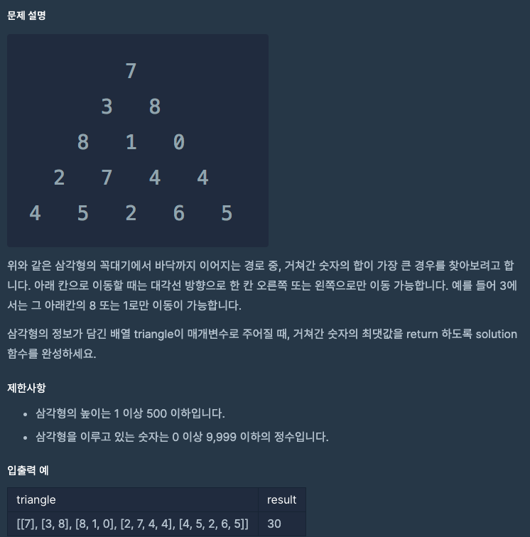

# leve3 - 정수삼각형



## Concept

아 기억났다 이런 문제는 밑에서 부터 올라가면 쉽다.

if(index == 0)
윗 배열[0] = 위의 배열[0] + 자신
else
윗 배열[자신인덱스] = 위의 배열[자신인덱스] + 자신
윗 배열[0] = 위의 배열[0] + 자신

보면 결국 윗 배열[0] = 위의 배열[0] + 자신 이 부분이 겹치는데 이부분에서 Math.max 를 이루게 하면된다.

그럼 위로 올라가면서 각 선택들에 대한 최대값들만 올라갈테고 마지막 꼭대기에는 최선의 선택의 값이 올라가게 된다.

## 풀이

```java
class Solution {
    public int solution(int[][] triangle) {
        int answer = 0;
        for(int i = triangle.length-1; i >= 1; i--) {
            for(int j = 1; j < triangle[i].length; j++) {
               triangle[i-1][j-1] = 
                   Math.max(triangle[i][j] + triangle[i-1][j-1], triangle[i][j-1] + triangle[i-1][j-1]);
            }
        }
        answer = triangle[0][0];
        return answer;
    }
}
```

## 느낀점

이건 그냥 짬에서 나오는 바이브로 푼게아닌가..? 그냥 많이 풀어봐서 알고있던 유형이여서 빨리풀었다.
